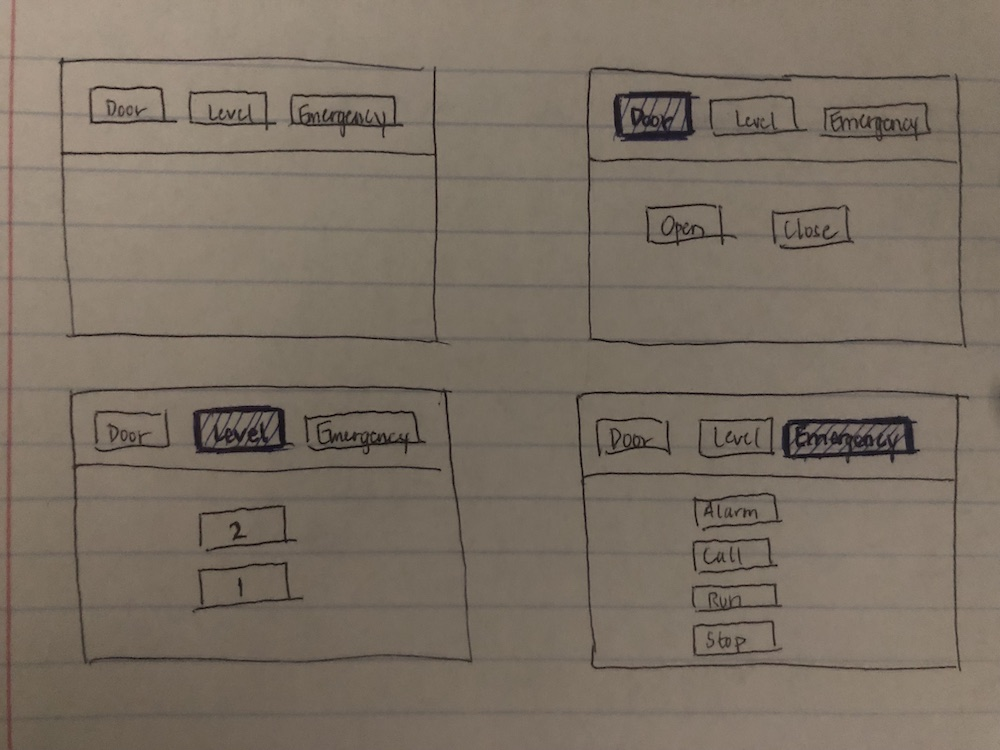
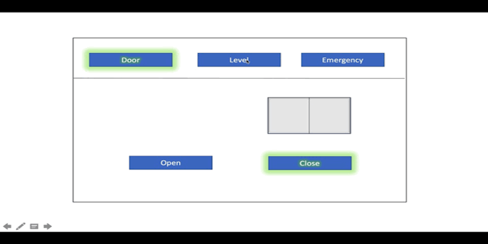

# hw1_CS3366
elevator interface

Get a C:

This is the elevator in the electrical engineering building at Texas Tech University

Current issues with interface:
1. The triangle setup is not appealing and could be difficult on the eye for a user. It would be extremely difficult to see whats going on if more buttons for floors or emergency options.

2. Each set of two buttons do not have similarities except for the floors. 
Ex: The open and close door buttons are not in the same grouping. Same goes for the emergency buttons.

3. The emergency phone is not even in the same area as the main interface. Its way lower. I did not realize that until I got home and saw it on my gif.

Get a B:

Common uses of an elevator: 
1. It is more convenient to take if there are multiple levels to a floor.

2. If you are carrying a lot of objects (books, bags, boxes), the elevator can take some of that weight off of you.

Think about how the user interacts with the elevator. What is the common sequence of actions?
Here is a common order of action taken to use an elevator:

1. Request an elevator, either up or down from outside the elevator.

2. Once inside you can close the door, or maybe open the door if it is closing and someone else once in.

3. Then, select the floor level that you'd like to go.

4. OPTIONAL. For any emergency you can sound an alarm or call for an emergency.

How does the elevator support the user figure out how to make it work?
A user figures out how it works by the symbols, numbers, or words placed on the buttons to indicate which one should be pressed.

How does the elevator provide feedback to the user?
Elevators normally provide feedback to the user so they know they have clicked a button by it lighting up and/or make a sound.

What are some common mistakes you can make with this current design?
For the design of the electrical engineering building elevator at Texas tech, some common mistakes that a user can make is hitting the alarm or bell button on accident if they were just trying to open the door for another user. Spacing is important and organization is important. This elevator does not have good enough spacing or organization.

Above are my design sketches that I think will help bring the usability of this elevator to the next level.
The top left sketch is the three main menu buttons and none of the buttons have been clicked on. 
The following three sketches(top right and both bottom sketches)show that a menu button has been clicked and the interface that pops up.
The reason this is a better design is the organization and no misleading button indicators. For example, if I click on the menu button "door" I will then, only have options therafter that deal with the door via opening and closing the door.
I think this idea came about because the three groupings of the originally elevator up above are not grouped together with buttons that have similar features.
Seems like you really wouldn't make too many errors in this elevator with only two floors but imagine this original interface on a elevator that is in a 50 floor building. Now that setup would seem a little weird if it was a triangle group interface.

Get a A:

